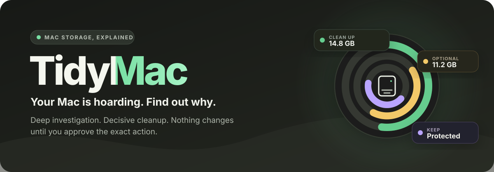

<p align="center">
  
</p>

<p align="center">
  <a href="https://github.com/azohra/tidymac/releases/latest"></a>
  
  
  
</p>

<p align="center">
  A judgment-driven storage investigator for Claude Code and Codex.<br>
  <a href="#install">Install</a> · <a href="#what-it-feels-like">See an example</a> · <a href="#safety">Safety model</a>
</p>

TidyMac finds what occupies a Mac, investigates why it exists, and gives the decision first:

| Decision | Meaning |
|---|---|
| 🟢 **Clean up** | Verified disposable data with a concrete action |
| 🟡 **Optional** | Real recovery with a noticeable tradeoff |
| 🟣 **Keep** | Active, personal, non-regenerable, unknown, or unsupported data |

Nothing changes until you approve the exact action.

## How it works

| ① Investigate | ② Explain | ③ Decide | ④ Verify |
|:---:|:---:|:---:|:---:|
| Measure the Mac and interrogate detected tools | Connect size to ownership, activity, and regeneration cost | Separate **Clean up**, **Optional**, and **Keep** | Recheck approved actions and measure what changed |

## What it feels like

Ask:

```text
$tidymac
```

Get:

```text
Clean up · 14.8 GB
  Package downloads       9.9 GB  Redownloaded only if needed
  Old diagnostic logs     4.6 GB  Old troubleshooting history
  Browser cache           0.3 GB  Regenerates silently

Optional · 11.2 GB
  Project build output    6.1 GB  Requires a rebuild
  Local model             5.1 GB  Requires a redownload

Keep
  Photos library                  Personal originals
  Active runtime volume           Stateful and in use
```

<sub>Synthetic example. Real findings come from the audited Mac.</sub>

Choose a group or finding. TidyMac rechecks it, shows the exact command or native action, asks once for informed approval, runs only the selection, and measures what changed.

## Install

```bash
npx skills add 'azohra/tidymac#v3.4.1' --global -a claude-code -a codex
```

Invoke it with your host’s syntax:

| Host | Invocation |
|---|---|
| Claude Code | `/tidymac` |
| Codex | `$tidymac` |

Node.js only copies the skill. TidyMac has no runtime package, Python, Node.js, daemon, compiled helper, service, or API dependency.

<details>
<summary><strong>Manual install</strong></summary>

Download this repository or a release archive, then copy the complete folder:

```bash
mkdir -p "$HOME/.claude/skills" "$HOME/.agents/skills"
cp -R /path/to/tidymac/skills/tidymac "$HOME/.claude/skills/tidymac"
cp -R /path/to/tidymac/skills/tidymac "$HOME/.agents/skills/tidymac"
```

Use the first destination for Claude Code, the second for Codex, or both. That eight-file folder is the runtime product.

</details>

## Why it is a skill

Finding a large directory is easy. Deciding whether it is disposable is contextual.

An `8 GB cache` may regenerate silently, require a six-hour download, accelerate active work, or be mislabeled state. `Application Support` may be abandoned settings—or the only local copy of a workflow.

TidyMac correlates native inventories, dry-runs, owners, activity, manifests, receipts, timestamps, and current documentation. Size finds the suspect; evidence decides the action.

## Where it looks

| Area | Examples |
|---|---|
| Apps and macOS | Caches, app support, containers, logs, Mail, Messages, Photos, browsers, Trash, device backups |
| Development | Xcode, package caches, runtimes, build output, worktrees, virtual environments |
| Containers and VMs | Docker Desktop, OrbStack, Podman, Colima, Parallels, VMware Fusion, UTM |
| Local AI | Ollama, Hugging Face, LM Studio, model revisions, shared downloads |
| Cloud | Local File Provider copies that may be evicted without deleting remotely |
| Creative and games | Generated media, sound libraries, game libraries, relocatable assets |
| Mystery space | Unknown app ownership, opaque disks, inaccessible scope, APFS and OS-managed context |

The audit starts broad, follows detected evidence, and lowers its scan floor until another pass no longer changes the explanation or recommendation.

## Ask for an outcome

No storage vocabulary is required:

```text
Why is my Mac full?
```

```text
Tell me what to clean, what is optional, and what to keep.
```

```text
I need 20 GB. Find the least painful way to get it.
```

```text
Free as much space as you reasonably can without disrupting my work.
```

## Opportunity report

On hosts with rich output, TidyMac can generate an interactive report from the same records and arithmetic as the text answer.

It shows decision totals first, then coverage, reconciliation, and individual findings. Finding size means observed local allocation—not promised recovery. Selecting findings prepares exact previews; it cannot execute commands or count as approval.

A standalone report uses the bundled offline HTML template with no remote assets or command bridge.

## Safety

- Audits are read-only by default.
- Every mutation is tied to an exact approved finding and action.
- Unknown data stays out of cleanup groups.
- Personal content remains aggregate context unless deeper review is requested.
- The current project tree is excluded from path cleanup.
- Native cleanup, cloud eviction, relocation, Trash, synced deletion, reset, and permanent deletion remain separate scopes.
- Direct-path cleanup uses a revalidated Trash move, never improvised recursive deletion.
- Trash is staged space until reviewed and emptied.
- Stateful volumes, backups, archives, and opaque VM disks receive individual treatment.

Understanding is automatic. Changing the machine is explicit.

## Requirements

- macOS
- Claude Code or Codex
- A strong reasoning model for a full-machine audit

Optional tools such as `brew`, `docker`, and `xcrun` are used only when already installed and relevant. TidyMac does not call its own service, transmit the audit, or bundle credentials.

## Releases

TidyMac uses [semantic GitHub releases](https://github.com/azohra/tidymac/releases): patch for fixes, minor for backward-compatible behavior, major for incompatible contracts.
